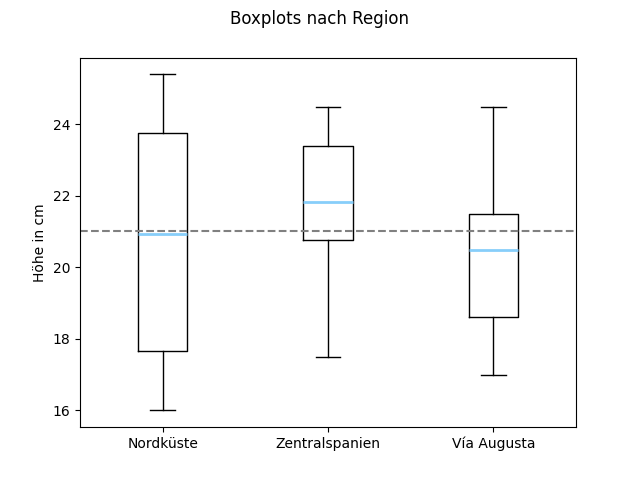

<div align="center">

# Hispanic Bronze Ewers and Bowls in the Context of Late Antiquity and the Early Middle Ages: Studies on the Typology, Production, Chronology, and Use of the Iberian Vessel Group
</div>


This repository provides the source code for the statistical analyses conducted as part of a doctoral dissertation focused on a specific group of Late Antique bronzes from the Iberian Peninsula, commonly referred to as 'jarritos y patenas litúrgicas de la época hispanovisigoda'. Until now, the production, use, and chronological classification of these objects have received only limited scholarly attention.
As part of this research project, an up-to-date catalog of known bronze ewers and bowls was compiled through extensive fieldwork, including research trips and on-site examinations in museums and (private) collections across Spain and Portugal. The resulting dataset comprises 94 bronze objects — 62 ewers and 32 bowls, including fragmentary examples.
This study reveals that these Late Antique bronze vessels, often labeled as ‘Hispano-Visigothic liturgical’ objects, were far more than mere ritual artifacts. They reflect a high level of technological and artistic skill and offer valuable insights into the religious practices, social structures, and cultural dynamics of their time.

<div align="center">


</div>

## 🗂️ Repository Structure

```yaml
.
├── Pipfile
├── Pipfile.lock
├── README.md
├── data                   # Contains data of bowls and ewers
├── results                # Provides the results from the statistical evaluations performed
└── src                    # Source code 
```
1. The [`data`](data/) folder contains the dimensional data of [`ewers`](data/ewers/) and [`bowls`](data/bowls/) used for statistical analysis.

    - For [`ewers`](data/ewers/), the file [`dimensions_with_region.csv`](data/ewers/dimensions_with_region.csv) contains:  
  `category_number`, `height`, `handle_height`, `thickness`, `weight`, and `region`.

        Additionally, the file [`dimensions.csv`](data/ewers/dimensions.csv) includes:  
  `height`, `body_diameter`, `base_diameter`, and `base_height_of_ewer`.

    - For [`bowls`](data/bowls/), the file [`dimensions.csv`](data/bowls/dimensions.csv) includes the following attributes:  
  `category_number`, `height`, `weight`, and `thickness`.


2. The [`results`](results/) folder contains the outcomes of the statistical analyses.

   - The subfolder [`ewers/estimate_missing_values`](results/ewers/estimate_missing_values/) includes two linear regression models.  
     In these models, the dimensions `height` and `weight` are regressed against `handle_height`  
     to estimate the missing values for ewers where only the handle is preserved.

    - The subfolders [`ewers/linear_dependencies`](results/ewers/linear_dependencies/) and [`bowls/linear_dependencies`](results/bowls/linear_dependencies/)  
  contain visualizations of the linear regressions performed between various object dimensions.

    - The subfolder [`ewers/normal_distribution`](results/ewers/normal_distribution/) contains normal Q-Q plots and histograms  
  of ewer heights from the regions `all_regions`, `via_augusta`, `central_spain`, and `north_coast`.  
  Additionally, a [boxplot](results/ewers/normal_distribution/boxplot_fig_1_48.png) is included to compare the mean heights across regions.

3. The [`src`](src/) folder contains the source code used for analyses and data processing. The scripts [`analysis_ewers.py`](src/analysis_ewers.py) and [`analysis_bowls.py`](src/analysis_bowls.py) perform linear regressions between various object dimensions. The scripts [`handle_vs_height.py`](src/handle_vs_height.py) and [`handle_vs_weight.py`](src/handle_vs_weight.py) estimate missing values for ewers where only the handle is preserved.  Finally, [`height_by_region.py`](src/height_by_region.py) generates visualizations including histograms and Q-Q plots.


<table>
  <tr>
    <td></td>
    <td></td>
  </tr>
  <tr style="background-color:#f6f8fa">
    <td>Normal histogram and Q-Q plot with confidence bands for ewer heights across all regions.</td>
    <td>Boxplots of ewer heights for Nord Coast, Central Spain and <i>Vía Augusta</i>. The grey dotted line is the average across all groups.</td>
  </tr>
  <tr>
    <td></td>
    <td></td>
  </tr>
  <tr style="background-color:#f6f8fa">
    <td>Linear regression with prediction interval and estimated heights for ewers where only the handle is preserved (in blue).</td>
    <td>Linear regression between "base_height_of_ewer" and "height", with p-value of the regression parameter.</td>
  </tr>
</table>


## 🚀 Quick Start

1. Clone the repository:

```bash
git clone https://github.com/LKHeinze/Hispanic-Bronze-Ewers-and-Bowls
```

2. Install the dependencies:

```bash
pip install pipenv
pipenv install --dev
```

3. Estimate missing ewer `height`:

```bash
pipenv run python -m src.handle_vs_height  
```

4. Estimate missing ewer `weight`:
```bash
pipenv run python -m src.handle_vs_weight default_config --plot True
```

5. Analyse linear relationships of bowl dimensions (f.e. `thickness` and `weight`) run:
```bash
pipenv run python -m src.analysis_bowls --target "Gewicht: insgesamt (in g)" --feature "Stärke: Rand (in cm)" 
```
6. Analyse linear relationships of ewer dimensions (f.e. `base_height_of_ewer` and `height`) run:
```bash
pipenv run python -m src.analysis_ewers --target "Höhe insg." --feature "Fusshöhe"
```

7. Check for distributional normality of ewer heights by region (available: `all_regions`, `augusta`, `central` and `north`) and to compare the mean across regions:
```bash
pipenv run python -m src.height_by_region --region "all_regions"
```

## 📖 Citing

If this work helped you with you, please cite:

```bibtex
@phdthesis{heinze_hispanic_2025,
	title = {Hispanic {Bronze} {Ewers} and {Bowls} in the {Context} of {Late} {Antiquity} and the {Early} {Middle} {Ages}: {Studies} on the {Typology}, {Production}, {Chronology}, and {Use} of the {Iberian} {Vessel} {Group}},
	url = {https://github.com/LKHeinze/Hispanic-Bronze-Ewers-and-Bowls},
	school = {Georg-August University of Göttingen},
	author = {Heinze, Lisa K.},
	month = jun,
	year = {2025},
}
```


## 📞 Contact

For any queries or questions, please reach out to me via e-mail:

- [Lisa K. Heinze][email-ref]

[email-ref]: mailto:l.heinze@stud.uni-goettingen.de

If this project helped you, I would appreciate it if you could star ⭐ the repository. Thanks for your support!
